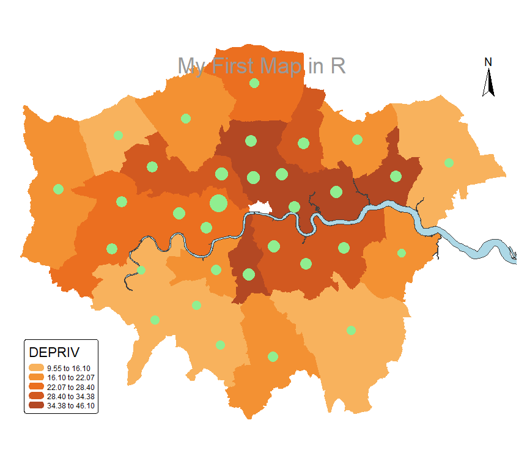
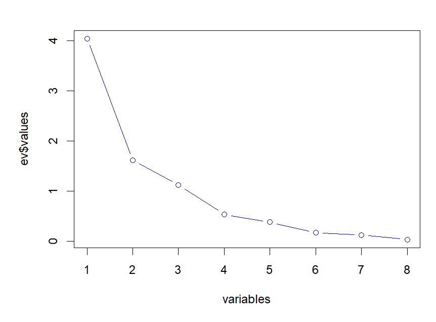
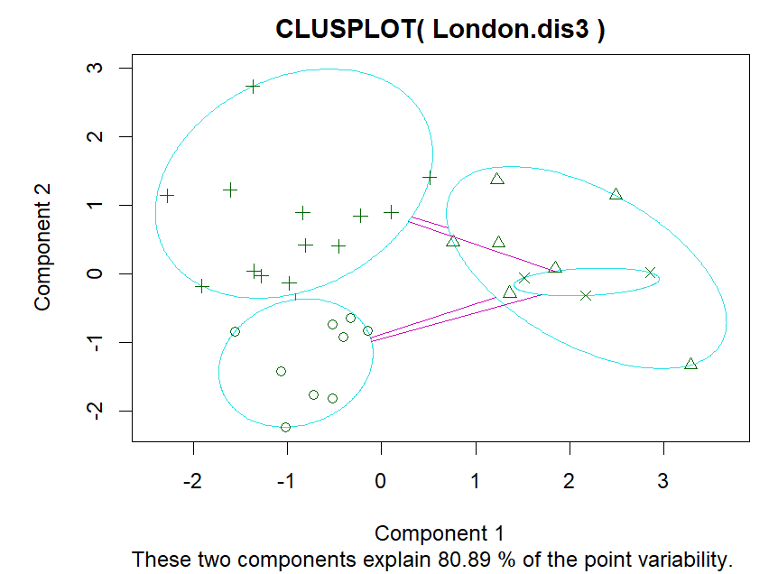
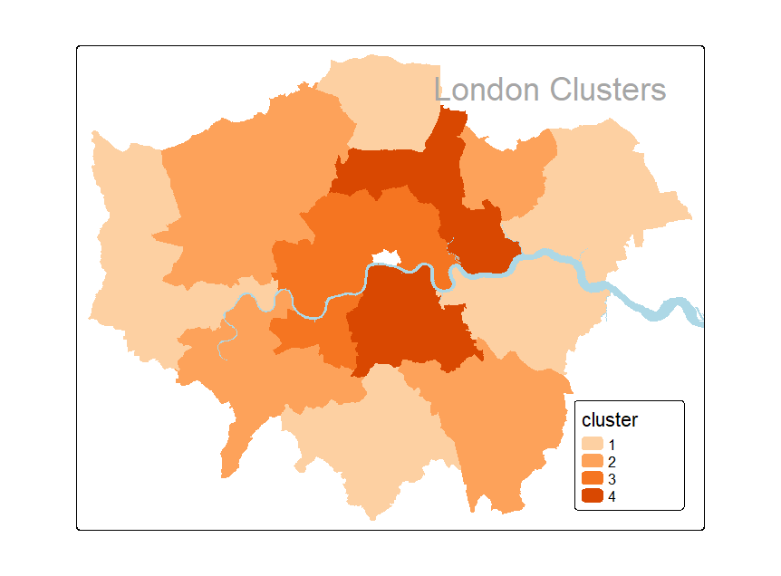
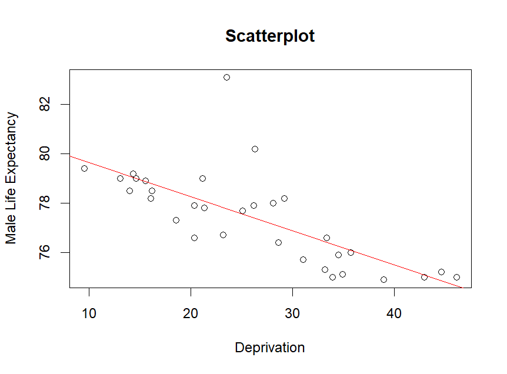
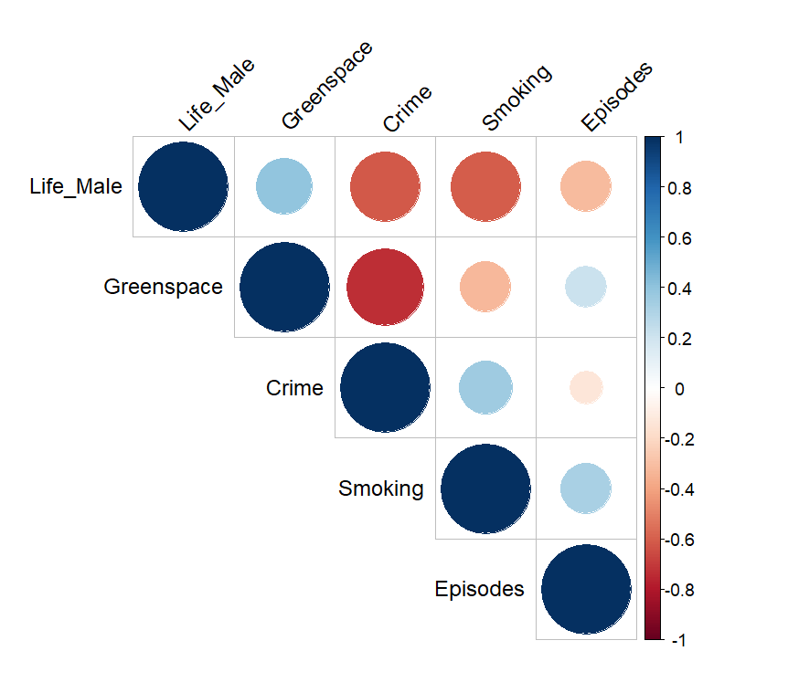

 # Quantitative Data Analysis Portfolio

## Project Overview

This portfolio demonstrates the application of quantitative data analysis techniques using Excel, SQL and R.

The work covers database querying, probability and statistical testing, exploratory data analysis, correlation analysis, principal component analysis (PCA), clustering, regression and predictive modelling. The exercises use datasets from areas including public health, crime, deprivation and demographic analysis.

## Tools & Technologies

- R
- SQL
- Microsoft Excel
- Statistical Analysis
- Data Visualisation
- Hypothesis Testing
- Principal Component Analysis (PCA)
- Cluster Analysis
- Multiple Regression
- Logistic Regression
- Poisson Regression

## SQL and Database Analysis

SQL was used to query relational data and retrieve information based on specified conditions.

The database exercises included:

- Filtering and sorting records
- Joining related tables
- Retrieving records based on surveyor and soil characteristics
- Working with relational database structures

The `sql/` folder contains SQL queries reproduced from the database exercises documented in the portfolio.

## Statistical Analysis

A range of statistical methods were applied to investigate relationships and differences within the datasets.

These included:

- Chi-squared tests
- Wilcoxon signed-rank tests
- Mann-Whitney U tests
- Kolmogorov-Smirnov tests
- t-tests
- Analysis of Variance (ANOVA)
- Tukey HSD
- Kruskal-Wallis tests
- Spearman correlation
- Partial correlation

Both parametric and non-parametric approaches were used depending on the characteristics of the data and the assumptions of the statistical tests.

## Deprivation and Crime Analysis

Spatial and statistical analysis was used to investigate patterns in deprivation and crime across London.

The analysis explored how socioeconomic conditions varied geographically and provided a basis for further multivariate analysis.

## Principal Component Analysis

Principal Component Analysis was used to reduce correlated variables into a smaller number of components.

The analysis examined how much variance was explained by successive components and helped identify underlying structure within the socioeconomic variables.

## Cluster Analysis

Clustering techniques were used to identify groups of observations with similar characteristics.

### K-Means Clustering

K-means clustering was applied to group observations based on similarities across selected variables.

### London Borough Clusters

The resulting clusters were also examined geographically to identify spatial patterns across London boroughs.

## Regression Analysis

### Deprivation and Male Life Expectancy

Regression analysis was used to investigate the relationship between deprivation and male life expectancy.

The analysis showed a negative relationship between deprivation and male life expectancy, with higher deprivation associated with lower life expectancy.

### Multiple Regression

Several multiple regression models were evaluated using health, socioeconomic and environmental variables.

The modelling process included:

- Model comparison
- Variable selection
- Multicollinearity assessment
- Residual diagnostics
- Stepwise regression
- Relative importance analysis

The analysis examined how combinations of socioeconomic, health and environmental factors were associated with variation in male life expectancy.

### Correlation Analysis

Correlation analysis was used to examine relationships among variables included in the modelling process.

## Logistic Regression

Logistic regression was applied to investigate factors associated with low birth weight.

The analysis considered variables including smoking status, ethnicity and maternal weight and examined their relationship with the probability of low birth weight.

Odds ratios were used to interpret the effects of predictors on the binary outcome.

## Poisson Regression

Poisson modelling was used for count data analysis.

The portfolio examined relationships between murder counts and socioeconomic/environmental predictors, including benefits, greenspace and non-domestic buildings.

Poisson and quasi-Poisson approaches were considered as part of the modelling process.

## Key Findings

- Statistical testing demonstrated how parametric and non-parametric methods can be selected according to data characteristics.
- PCA reduced correlated socioeconomic variables into a smaller number of components.
- Cluster analysis identified groups with similar socioeconomic characteristics.
- Deprivation showed a negative relationship with male life expectancy.
- Multiple regression demonstrated how several health, socioeconomic and environmental variables can be considered simultaneously.
- Logistic regression was used to investigate factors associated with low birth weight.
- Poisson regression demonstrated modelling of count-based outcomes.

## Repository Structure

- `images/` - selected analysis visualisations
- `report/` - complete cleaned portfolio report
- `sql/` - SQL queries from the database exercises
- `r/` - reconstructed R analysis based on documented commands and outputs
- `README.md` - project overview, methods and findings

## Code Availability

The original complete R script used for the coursework is not available. The R file included in this repository reconstructs selected analyses from the commands, models and outputs documented in the original portfolio report. It is provided to make the analytical workflow easier to understand and is clearly identified as reconstructed code.

## Key Skills Demonstrated

R · SQL · Excel · Statistical Analysis · Hypothesis Testing · Data Cleaning · Exploratory Data Analysis · PCA · Clustering · Correlation Analysis · Multiple Regression · Logistic Regression · Poisson Regression · Model Diagnostics · Data Visualisation

## Full Report

The complete quantitative data analysis portfolio is available in the `report/` folder.
